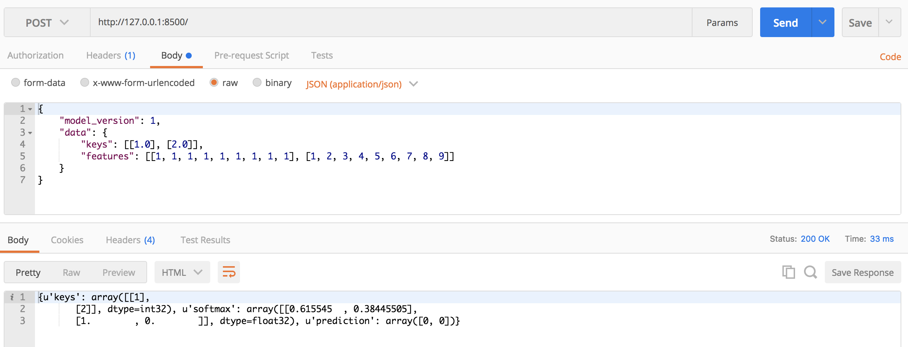

# Clients

## Bash

Here is the example client in [Bash](./bash_client/).

```
curl -H "Content-Type: application/json" -X POST -d '{"data": {"keys": [[1.0], [2.0]], "features": [[10, 10, 10, 8, 6, 1, 8, 9, 1], [6, 2, 1, 1, 1, 1, 7, 1, 1]]}}' http://127.0.0.1:8500
```

## Python

Here is the example client in [Python](./python_client/).

```python
endpoint = "http://127.0.0.1:8500"
payload = {"data": {"keys": [[11.0], [2.0]], "features": [[1, 1, 1, 1, 1, 1, 1, 1, 1], [1, 1, 1, 1, 1, 1, 1, 1, 1]]}}

result = requests.post(endpoint, json=payload)
```


## Golang

```go
endpoint := "http://127.0.0.1:8500"
dataByte := []byte(`{"data": {"keys": [[11.0], [2.0]], "features": [[1, 1, 1, 1, 1, 1, 1, 1, 1], [1, 1, 1, 1, 1, 1, 1, 1, 1]]}}`)
var dataInterface map[string]interface{}
json.Unmarshal(dataByte, &dataInterface)
dataJson, _ := json.Marshal(dataInterface)

resp, err := http.Post(endpoint, "application/json", bytes.NewBuffer(dataJson))
```

## Ruby

Here is the example client in [Ruby](./ruby_client/).

```ruby
endpoint = "http://127.0.0.1:8500"
uri = URI.parse(endpoint)
header = {"Content-Type" => "application/json"}
input_data = {"data" => {"keys"=> [[11.0], [2.0]], "features"=> [[1, 1, 1, 1, 1, 1, 1, 1, 1], [1, 1, 1, 1, 1, 1, 1, 1, 1]]}}
http = Net::HTTP.new(uri.host, uri.port)
request = Net::HTTP::Post.new(uri.request_uri, header)
request.body = input_data.to_json

response = http.request(request)
```

## JavaScript

Here is the example client in [JavaScript](./javascript_client/).

```javascript
var options = {
    uri: "http://127.0.0.1:8500",
    method: "POST",
    json: {"data": {"keys": [[11.0], [2.0]], "features": [[1, 1, 1, 1, 1, 1, 1, 1, 1], [1, 1, 1, 1, 1, 1, 1, 1, 1]]}}
};

request(options, function (error, response, body) {});
```

## PHP

Here is the example client in [PHP](./php_client/).

```php
$endpoint = "127.0.0.1:8500";
$inputData = array(
    "keys" => [[11.0], [2.0]],
    "features" => [[1, 1, 1, 1, 1, 1, 1, 1, 1], [1, 1, 1, 1, 1, 1, 1, 1, 1]],
);
$jsonData = array(
    "data" => $inputData,
);
$ch = curl_init($endpoint);
curl_setopt_array($ch, array(
    CURLOPT_POST => TRUE,
    CURLOPT_RETURNTRANSFER => TRUE,
    CURLOPT_HTTPHEADER => array(
        "Content-Type: application/json"
    ),
    CURLOPT_POSTFIELDS => json_encode($jsonData)
));

$response = curl_exec($ch);
```

## Erlang

Here is the example client in [Erlang](./erlang_client/).

```erlang
ssl:start(),
application:start(inets),
httpc:request(post,
  {"http://127.0.0.1:8500", [],
  "application/json",
  "{\"data\": {\"keys\": [[11.0], [2.0]], \"features\": [[1, 1, 1, 1, 1, 1, 1, 1, 1], [1, 1, 1, 1, 1, 1, 1, 1, 1]]}}"
  }, [], []).
```

## Lua

Here is the example client in [Lua](./lua_client/).

```lua
local endpoint = "http://127.0.0.1:8500"
keys_array = {}
keys_array[1] = {1.0}
keys_array[2] = {2.0}
features_array = {}
features_array[1] = {1, 1, 1, 1, 1, 1, 1, 1, 1}
features_array[2] = {1, 1, 1, 1, 1, 1, 1, 1, 1}
local input_data = {
    ["keys"] = keys_array,
    ["features"] = features_array,
}
local json_data = {
    ["data"] = input_data
}
request_body = json:encode (json_data)
local response_body = {}

local res, code, response_headers = http.request{
    url = endpoint,
    method = "POST", 
    headers = 
      {
          ["Content-Type"] = "application/json";
          ["Content-Length"] = #request_body;
      },
      source = ltn12.source.string(request_body),
      sink = ltn12.sink.table(response_body),
}
```

## Perl

Here is the example client in [Perl](./perl_client/).

```perl
my $endpoint = "http://127.0.0.1:8500";
my $json = '{"data": {"keys": [[11.0], [2.0]], "features": [[1, 1, 1, 1, 1, 1, 1, 1, 1], [1, 1, 1, 1, 1, 1, 1, 1, 1]]}}';
my $req = HTTP::Request->new( 'POST', $endpoint );
$req->header( 'Content-Type' => 'application/json' );
$req->content( $json );
$ua = LWP::UserAgent->new;

$response = $ua->request($req);
```

## R

Here is the example client in [R](./r_client/).

```r
endpoint <- "http://127.0.0.1:8500"
body <- list(data = list(a = 1), keys = 1)
json_data <- list(
  data = list(
    keys = list(list(1.0), list(2.0)), features = list(list(1, 1, 1, 1, 1, 1, 1, 1, 1), list(1, 1, 1, 1, 1, 1, 1, 1, 1))
  )
)

r <- POST(endpoint, body = json_data, encode = "json")
stop_for_status(r)
content(r, "parsed", "text/html")
```
## Postman

Here is the example with Postman.

